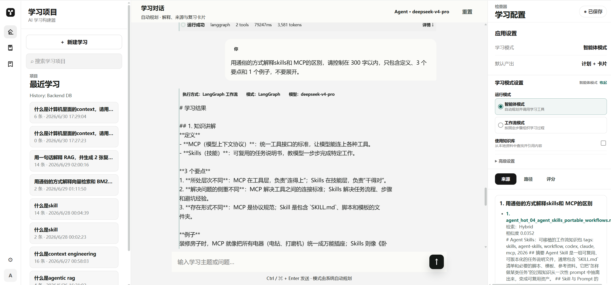
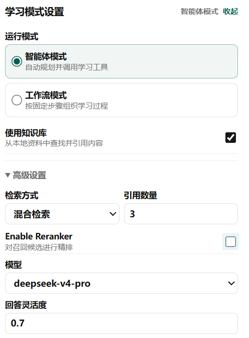
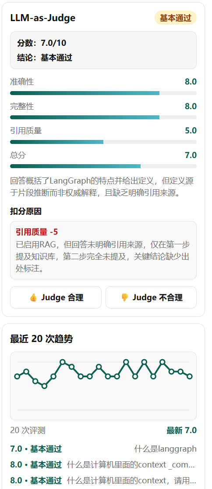

# AI Study Assistant

## 项目概览

AI Study Assistant 是一个面向学习场景的 AI 应用，而不是普通的 ChatGPT 套壳。它通过统一的 `POST /chat` API 连接本地 RAG、Agent Tool Registry 与可选 LangGraph Runtime，让回答可以检索本地知识、调用工具并保留来源。系统同时记录运行、追踪、工具调用、延迟、Token/成本与 Judge 结果，便于调试和评估。项目包含可复现的离线 RAG 基准评测，覆盖正样本效果、知识库外查询拒答、PDF/OCR 与分块质量治理。

## 核心亮点

- **统一 `/chat` API**：统一承载普通对话、RAG、Agent 与 LangGraph 执行路径。
- **本地 RAG**：本地 FAISS/文档索引，支持 Vector、BM25、Hybrid RRF 与 CrossEncoder Reranker。
- **离线基准评测**：V1/V2/V3 分阶段构建语料库，V3 覆盖 55 条案例；指标和原始结果可复现、可审计。
- **检索质量治理**：修复负样本来源污染，并过滤 PDF/OCR 产生的低质量分块。
- **Tool Registry 安全机制**：工具按读取、写入、危险操作分级，危险操作必须显式审批。
- **运行可观测性**：统一查看计划、追踪、工具调用、来源、延迟、Token/成本与 Judge 结果。

## 功能截图

### 主界面



### 功能设置



### 工具调用 / 运行追踪


### Judge 评估



## 架构与请求流程

```text
React / Vite 前端
  → POST /chat（FastAPI）
  → 本地 RAG / Agent Tool Registry / 可选 LangGraph Runtime
  → RunRepository
  → 运行追踪 / 来源 / 工具调用 / Judge
```

一次请求生成 `run_id`，RAG sources、执行计划和工具调用随 Run 聚合保存；前端使用同一份运行数据展示结果与诊断信息。

## RAG 基准评测

评测为本地离线检索实验，不调用 LLM API。Top-1、Top-3 和 MRR 基于 V3 的 40 条正样本；拒答成功率与来源污染率基于 15 条知识库外负样本。

### 语料规模

| 版本 | 文档数 | 分块数 | 案例数 | 语料说明 |
|---|---:|---:|---:|---|
| V1 | 51 | 341 | 20 | 本地项目文档 |
| V2 | 56 | 352 | 35 | V1 + 5 篇精选官方文档摘要 |
| V3 | 63 | 1292 | 55 | V2 + arXiv 论文 PDF 与 OCR 测试夹具 |

### V3 正样本结果

| 检索模式 | Top-1 | Top-3 | MRR | 平均延迟 |
|---|---:|---:|---:|---:|
| Vector | 52.5% | 67.5% | 0.596 | 17.7 ms |
| BM25 | 72.5% | 82.5% | 0.771 | 47.5 ms |
| Hybrid | 60.0% | 82.5% | 0.710 | 73.4 ms |
| Hybrid + Reranker | **82.5%** | **90.0%** | **0.863** | 2114.4 ms |

### 来源污染修复

| 指标 | 修复前 | 修复后 |
|---|---:|---:|
| Hybrid / Reranker 来源污染率 | 100.0% | **26.7%** |
| Hybrid / Reranker fallback 成功率 | 0.0% | **73.3%** |
| Reranker Top-1（正样本） | 82.5% | 82.5% — 不变 |
| Reranker MRR（正样本） | 0.863 | 0.863 — 不变 |

修复在 Hybrid 上游增加统一门控：当 Vector 无有效结果时，只有足够强的 BM25 信号才允许返回来源。Reranker 继承该门控，因此负样本拒答改善，同时正样本 Top-1/MRR 保持不变。

### 分块质量过滤

| 过滤前 | 过滤后 | 丢弃 | 标记为 `low_quality` | 保留 OCR 分块 | 检索指标 |
|---:|---:|---:|---:|---:|---|
| 1292 | **1242** | 50 | 16 | **45 / 45** | 无回退 |

过滤器清理 PDF/OCR 解析产生的噪声分块，同时保留全部 OCR 分块；后续计划对 `low_quality` 分块做降权，而不是直接删除。

### 报告与复现

- [完整基准评测报告](reports/RAG_V1_V2_V3_BENCHMARK.md)
- [机器可读指标](reports/RAG_V1_V2_V3_METRICS.json)
- [V3 评测案例](eval_cases/rag_v3_cases.json)
- [基准评测脚本](scripts/benchmark_rag_batch.py)

## 工具安全

Tool Registry 将工具分为读取（`read`）、写入（`write`）和危险操作（`dangerous`）。危险工具必须经过独立的请求方与审批方凭据确认；一次性令牌与工具名、调用参数和请求者绑定，参数变化或令牌复用都会被拒绝。所有调用状态、耗时、参数摘要和审批事件写入追加式 JSONL 审计日志，并可关联到对应运行记录。

## 运行可观测性

`/chat` 返回 `run_id`，`/runs/{run_id}` 可查看请求状态、plan、tool calls、audit、artifacts、output 与 metadata。运行视图聚合 trace、RAG sources、各步骤 latency、token usage、estimated cost 和 Judge 结果，便于定位 planner fallback、检索 miss 与工具失败。

## 快速开始

要求 Python 3.11+ 与 Node.js 18+。

### 安装后端依赖

```powershell
python -m venv .venv
.\.venv\Scripts\Activate.ps1
pip install -r requirements.txt
Copy-Item .env.example .env
```

在 `.env` 中配置模型 API key；本地离线测试不需要 key。

### 启动后端

```powershell
uvicorn backend.server:app --reload --host 127.0.0.1 --port 8000
```

### 启动前端

```powershell
npm install
npm run dev
```

前端默认地址：`http://127.0.0.1:5500`。

### 运行测试

```powershell
.\.venv\Scripts\python.exe -m pytest
.\.venv\Scripts\python.exe scripts/check_setup.py
npm run build
```

## 测试结果

2026-07-06 本地验证：

| 检查项 | 结果 |
|---|---|
| Python 测试套件 | **235 项通过，60 项子测试通过** |
| `scripts/check_setup.py` | **OK** |
| `npm run build` | **构建成功** |

## 当前限制

- 基准评测是本地离线实验，不代表生产环境或通用准确率。
- V3 仅包含 40 条正样本和 15 条负样本，统计规模仍有限。
- Reranker 效果最好，但本地平均延迟约 2.1 秒。
- OCR 专项正样本有限，不能据此宣称通用 OCR 准确率提升。
- BM25-only source pollution 仍是已知限制；简单阈值无法可靠区分正负样本。
- 文件型 RunRepository 与可选 SQLite 配置更适合单机原型，尚未面向分布式执行设计。

## 后续计划

- 对 `low_quality` chunk 降权，而不是只做硬过滤。
- 增加 context selection gate。
- 增加 history relevance filter。
- 为 BM25 增加 term coverage / entity matching。
- 扩充正负样本与 PDF/OCR eval cases。
