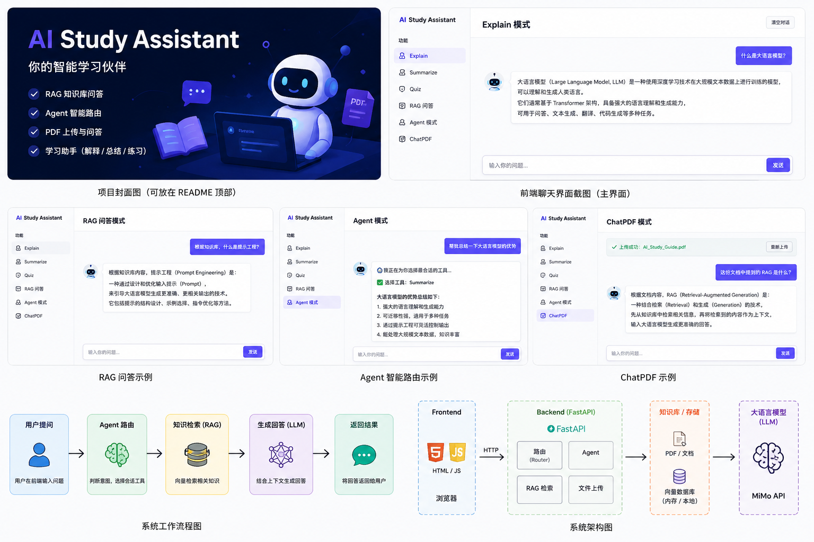
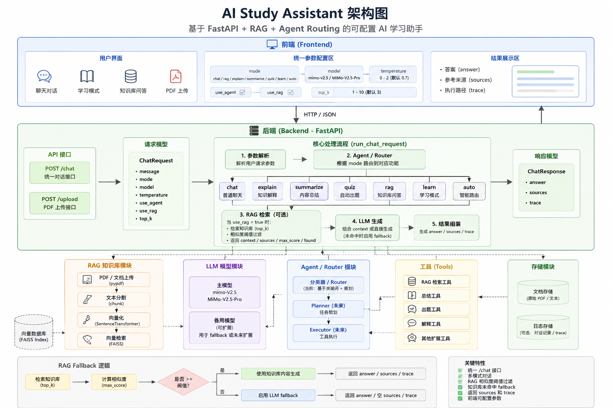
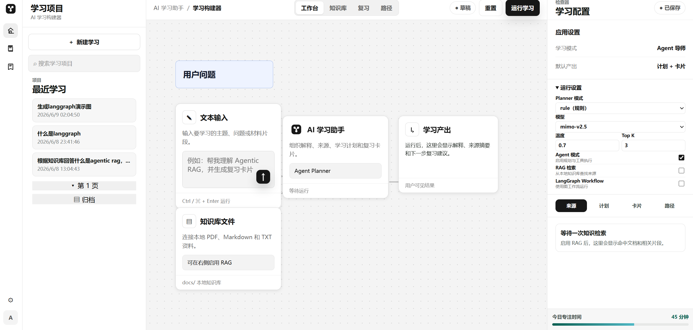
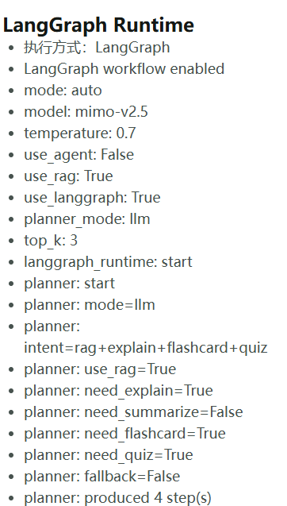
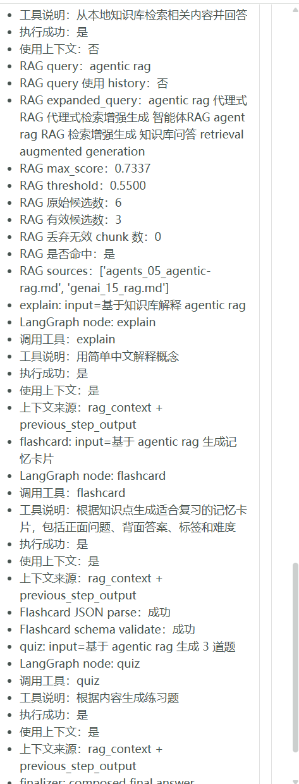
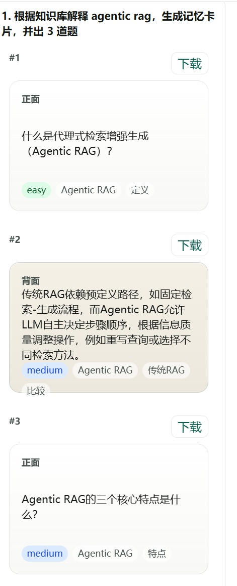

# AI Study Assistant



## 1. 项目简介

AI Study Assistant 是一个面向学习场景的 AI 应用开发项目，基于 **FastAPI + RAG + Agent + LangGraph Runtime** 构建。它不是简单 chatbot，而是集成了知识库问答、Agent 工具调用、学习解释、自动出题、记忆卡片、运行时可观测性和前端学习工作台的 AI 学习助手。

项目目标是把一个学习型 AI Demo 逐步升级为更接近真实产品形态的 AI 应用：后端提供统一 `/chat` 接口，前端提供 React / Vite Dashboard，RAG 支持来源追踪和 fallback，Agent 支持 Planner + Executor，LangGraph Runtime 作为可选执行路径用于实验、调试和后续迁移评估。

## 2. 项目亮点

- 统一 `/chat` 接口，承载 chat、RAG、Agent、LangGraph、flashcard 等能力。
- 默认稳定路径为 Legacy Planner + Executor Agent，LangGraph Runtime 可通过 `use_langgraph=true` 可选启用。
- LangGraph 支持 `planner_mode=rule | llm`，其中 `rule` 是默认模式，`llm` 是可选结构化 Planner。
- LLM Planner 使用 JSON-only prompt、`AgentPlan` schema、Pydantic validation 和 fallback，失败时回退 rule planner。
- Tool Registry 按 `read / write / dangerous` 分级，统一执行确认与 Audit Log。
- 前端“Dev Tool Debugger”支持分类浏览、JSON 参数调用、危险操作二次确认和 Audit Log 查看。
- `/chat` 返回 `run_id / run_summary / run_details`；每条 AI 回复下方挂载对应 Run，展开时从 RunRepository 读取 Overview、Plan、Tools、Audit 和 Artifacts。Judge 作为独立 Evaluation 展示。
- 每轮 Plan 与 Flashcards 直接显示在回答结果中；右侧检查器仅保留来源、路径和评分。
- RAG 支持 `sources / score / snippet / threshold / fallback`，避免弱相关知识库命中污染回答。
- LangGraph Runtime 返回 `graph_path / tool_calls / runtime_info`，便于对比和调试。
- LangGraph finalizer 用于减少 answer 重复堆叠，并将结构化 flashcards 与正文分离。
- React / Vite Dashboard 提供运行设置、学习空间、知识库文件、Sources、Plan、Trace、Runtime Info 和卡片展示。
- Flashcard 支持可视化翻面和 Canvas PNG 正反面下载。
- conversation history 通过 localStorage 保存到本地浏览器。
- knowledge-files API 支持浏览本地知识库文件。
- GitHub Actions CI 覆盖 backend setup check、offline unit tests 和 frontend build。
- `compare_runtimes.py` 和 `evaluate_llm_planner.py` 用于评估 Legacy Agent、LangGraph Rule Planner 和 LangGraph LLM Planner。

## 3. 功能列表

- 普通聊天和学习问答。
- 知识点解释：用更容易理解的方式解释概念。
- 内容总结：支持普通总结和结合知识库总结。
- 自动出题：生成练习题、自测题或选择题。
- RAG 知识库问答：基于 `docs/` 和上传文档构建本地向量索引。
- RAG threshold / fallback：低置信度检索不返回无关 sources。
- Legacy Agent：默认 Planner + Executor 执行路径。
- LangGraph Runtime：可选 StateGraph + conditional routing 执行路径。
- Planner Mode：`rule` 默认，`llm` 可选。
- Tool Registry：统一封装工具能力。
- Sources / Plan / Trace / Runtime Info：前后端均支持可观测性展示。
- Flashcards：结构化记忆卡片、卡片翻面、PNG 下载。
- Conversation History：最近对话本地保存。
- Knowledge Files：知识库文件列表、预览和内容查看。
- Smoke Test、Setup Check、Offline Unit Tests、GitHub Actions CI。
- Runtime Comparison 和 LLM Planner Evaluation 工具。

## 4. 技术栈

**Backend**

- Python
- FastAPI
- Pydantic
- Uvicorn
- python-dotenv

**LLM / Agent / Runtime**

- LangChain
- langchain-openai
- LangGraph
- OpenAI-compatible Chat API
- Planner + Executor Agent
- Tool Registry

**RAG**

- SentenceTransformer
- FAISS (`faiss-cpu`)
- pypdf
- 本地 `.txt / .md / .pdf` 文档加载
- chunk 清洗、query expansion、相似度阈值过滤

**Frontend**

- React
- Vite
- JavaScript
- HTML / CSS
- Canvas API
- localStorage

**Testing / CI**

- Python unittest
- GitHub Actions
- Vite build

## 5. 系统架构

项目中包含架构图：



文字版架构：

```text
User
↓
React / Vite Frontend Dashboard
↓
FastAPI Backend
↓
/chat Router
├── Legacy Agent Runtime
└── LangGraph Runtime
    ↓
RunRepository
├── Plan / Tools / Judge
├── Audit / Artifacts
└── Output / Status
    ↓
Tool Registry
├── RAG Tool
├── Explain Tool
├── Summarize Tool
├── Quiz Tool
├── Flashcard Tool
└── Chat Tool
↓
RAG Store / FAISS / Docs
```

## 6. Demo Screenshots

### Dashboard Main View



展示 React / Vite 学习工作台，包括对话区、运行设置、知识库入口、历史对话和学习空间。

### LangGraph Runtime Overview



展示 LangGraph Runtime 的 `planner_mode`、`planner_fallback`、`graph_path`、`node_count` 和 finalizer 状态。

### LangGraph Tool Calls



展示 LangGraph Runtime 中各个节点对 Tool Registry 的调用情况，包括 `rag`、`explain`、`flashcard`、`quiz` 等工具调用。

### Flashcards



展示结构化记忆卡片、翻面复习和 PNG 下载能力。

后续仍建议补充：

- [ ] Agent Plan / Trace
- [ ] Knowledge Files
- [ ] Runtime Settings

## 7. 运行时架构

### Legacy Agent Runtime

Legacy Agent Runtime 是当前默认稳定路径。

流程：

```text
/chat
↓
Planner
↓
Executor
↓
Tool Registry
↓
answer / sources / trace / plan / flashcards
```

特点：

- 默认不需要额外开关。
- Planner 生成工具执行计划。
- Executor 按 plan 调用 Tool Registry。
- 返回 `plan / trace / sources`，便于前端展示执行过程。

### LangGraph Runtime

LangGraph Runtime 是可选执行路径，通过 `use_langgraph=true` 启用。

流程：

```text
START
↓
planner
↓ conditional routing
rag / explain / summarize / chat / flashcard / quiz
↓
finalizer
↓
END
```

特点：

- 基于 LangGraph `StateGraph`。
- 支持 conditional routing。
- 节点复用 Tool Registry。
- finalizer 负责整理最终 answer，减少重复堆叠。
- 返回结构化 `runtime_info`，包括 `graph_path`、`tool_calls`、`planner_mode`、`planner_fallback` 等。

## 8. 项目结构

```text
ai-agent-study-assistant/
├── backend/
│   ├── server.py              # FastAPI 路由、/chat、debug、upload、knowledge-files
│   ├── schemas.py             # ChatRequest / ChatResponse / AgentPlan / Flashcard schema
│   ├── ai_core.py             # /chat 调度、legacy mode、LangGraph 分支
│   ├── agent_core.py          # Legacy Planner + Executor
│   ├── langgraph_runtime.py   # LangGraph Runtime、planner、nodes、runtime_info
│   ├── langgraph_demo.py      # LangGraph demo 兼容入口
│   ├── tools.py               # Tool Registry
│   ├── run_repository.py      # Run 聚合与持久化边界
│   ├── run_metadata.py        # 运行摘要与详情
│   ├── rag_store.py           # 文档加载、chunk、FAISS 索引
│   ├── rag_service.py         # RAG 检索、sources、fallback
│   ├── llm_service.py         # LLM 构建与基础能力
│   └── history_utils.py       # history 归一化和 prompt 注入
├── frontend/
│   ├── index.html
│   └── src/
│       ├── App.jsx            # React Dashboard 主界面
│       └── main.jsx           # React 入口
├── docs/                      # 本地知识库与评估文档
├── images/                    # README 图片资源
├── scripts/
│   ├── check_setup.py
│   ├── smoke_test.py
│   ├── compare_runtimes.py
│   └── evaluate_llm_planner.py
├── tests/                     # offline unit tests
├── uploads/                   # 本地上传文件目录
├── rag_index/                 # 本地 FAISS 索引缓存
├── package.json               # Vite / React 依赖与脚本
├── vite.config.js             # Vite root 指向 frontend/
├── requirements.txt
└── README.md
```

## 9. 快速开始

### Windows 一键启动（推荐）

双击项目根目录的 `start.bat`。启动器会自动检查运行环境、补齐缺失依赖、启动前后端，并在服务就绪后打开浏览器。

```text
Frontend: http://127.0.0.1:5500
FastAPI Docs: http://127.0.0.1:8000/docs
```

关闭弹出的 Backend 和 Frontend 窗口即可停止项目。首次运行需要已安装 Python 3.10+ 和 Node.js 18+，依赖安装可能需要几分钟。

### 手动启动

### 1. 安装后端依赖

```bash
pip install -r requirements.txt
```

### 2. 安装前端依赖

前端依赖文件在仓库根目录。因为项目已有 `package-lock.json`，推荐：

```bash
npm ci
```

如果不使用 lockfile，也可以：

```bash
npm install
```

### 3. 配置环境变量

```bash
cp .env.example .env
```

不要提交真实 API key。

### 4. 检查环境

```bash
python scripts/check_setup.py
```

### 5. 启动后端

```bash
uvicorn backend.server:app --reload
```

### 6. 启动前端

```bash
npm run dev
```

### 7. 访问

```text
FastAPI Docs: http://127.0.0.1:8000/docs
Frontend: http://127.0.0.1:5500
```

## 10. 环境变量配置

`.env.example` 中包含可用配置项：

```env
DEEPSEEK_API_KEY=your_api_key_here
DEEPSEEK_BASE_URL=https://api.deepseek.com
DEEPSEEK_MODEL=deepseek-v4-pro
DASHSCOPE_API_KEY=
ALIBABA_API_KEY=
QWEN_API_KEY=
```

API key 读取优先级：

```text
DEEPSEEK_API_KEY
```

说明：

- 本地真实 key 放在 `.env`，不要提交。
- `DEEPSEEK_BASE_URL` 可选，默认使用 DeepSeek API endpoint。
- CI 不配置真实 API key，也不会运行真实 LLM 调用。

## 11. 后端启动

```bash
uvicorn backend.server:app --reload
```

常用接口：

- `GET /health`
- `POST /chat`
- `GET /tools`
- `POST /tools/{tool_name}/invoke`
- `GET /tools/audit/recent`
- `GET /runs`
- `GET /runs/{run_id}`
- `POST /upload`
- `GET /knowledge-files`
- `GET /knowledge-files/{filename}`
- `GET /knowledge-files/{filename}/content`

旧的 `/explain`、`/summarize`、`/quiz`、`/rag`、`/agent`、`/learn` 和 `/rebuild-index` 路由继续兼容，但不再显示在 Swagger；新调用统一使用 `/chat` 或 Tool Registry。

## 12. 前端启动

前端基于 React / Vite，源码位于：

```text
frontend/src/App.jsx
```

启动：

```bash
npm run dev
```

Vite 配置在 `vite.config.js`，当前 dev server 配置为：

```text
http://127.0.0.1:5500
```

构建：

```bash
npm run build
```

构建产物不提交到 Git。

## 13. API 示例

### `/chat` 请求

```json
{
  "message": "根据知识库解释 agentic rag，生成记忆卡片，并出 3 道题",
  "mode": "auto",
  "model": "deepseek-v4-pro",
  "temperature": 0.3,
  "use_agent": true,
  "use_rag": true,
  "use_langgraph": true,
  "planner_mode": "rule",
  "top_k": 3,
  "history": []
}
```

### `/chat` 响应字段

- `run_id`：本次执行对应的 Run ID。
- `answer`：最终回答。
- `mode`：实际执行模式，例如 `agent`、`langgraph`、`chat`、`rag`。
- `model`：实际使用模型。
- `sources`：RAG 命中的来源列表。
- `trace`：人类可读执行过程。
- `plan`：Agent 或 LangGraph planner 生成的工具步骤。
- `flashcards`：结构化卡片数据。
- `runtime_info`：LangGraph Runtime 的结构化运行元数据。
- `run_summary / run_details`：运行摘要及可展开的 Plan、Tools 详情。

### RunRepository

一次 `/chat` 请求对应一个 Run。`RunRepository` 是运行数据的唯一聚合边界，提供：

- `create_run()` / `update_run()` / `finish_run()`
- `get_run()` / `list_runs()` / `delete_run()`

Planner 写入 `plan`，Tool Registry 写入 `tools` 与 `audit`，最终回答、来源和卡片写入 `artifacts/output`。Judge 结果独立保存在 Evaluation 存储中，只通过 `run_id` 与执行关联，不进入 Run 聚合。Run 以独立 JSON 文档持久化到 `data/runs/`，目录可通过 `RUNS_DIR` 调整。

读取接口为 `GET /runs` 与 `GET /runs/{run_id}`；删除 Run 通过 dangerous 工具 `delete_run` 完成，仍须一次性确认令牌。删除采用 soft delete：Run 保留为 `deleted` tombstone，并记录 `deleted_at` 与删除审计；`GET /runs` 默认隐藏软删除记录，可用 `include_deleted=true` 查询。Replay、History、Compare、Export 后续只需读取 Run，不需要侵入 Planner、Judge 或工具执行链。

## 14. 前端 Dashboard 说明

新版前端是 React / Vite Dashboard，核心源码：

```text
frontend/src/App.jsx
```

当前支持：

- 新建对话。
- 最近对话。
- localStorage 本地历史保存。
- 运行设置。
- RAG 开关。
- LangGraph Workflow 开关。
- Planner 模式选择：`rule` / `llm`。
- Knowledge Files 浏览和内容查看。
- Sources 展示。
- Plan 展示。
- Runtime Info 展示。
- Trace 展示。
- Flashcards 展示。
- 卡片翻面。
- PNG 正反面下载。
- 卡片库 / 学习空间相关区域。

## 15. RAG 工作流程

RAG 流程：

```text
docs / uploads
↓
文本读取与 PDF 解析
↓
chunk 清洗与切分
↓
SentenceTransformer embedding
↓
FAISS index
↓
top_k 检索
↓
threshold 判断
├── 命中：返回 context + sources
└── 未命中：fallback，不返回无关 sources
```

RAG 返回的 source 通常包含：

- `source`
- `score`
- `snippet`
- `text`

当前 RAG 重点不是追求复杂检索算法，而是保证学习场景中的来源可追踪、低置信度可 fallback、回答不被无关文档污染。

## 16. Agent / Tool Registry 工作流程

Legacy Agent 工作流程：

```text
User Request
↓
Planner
↓
AgentPlan schema validation
↓
Executor
↓
Tool Registry
↓
Final Response
```

Tool Registry 位于 `backend/tools.py`，当前工具包括：

- read：`chat`、`rag_search`、`study`
- write：`save_note`、`save_flashcards`、`save_quiz`
- dangerous：`delete_saved_item`、`delete_knowledge_file`、`reset_saved_items`、`reset_rag_index`、`rebuild_rag_index`、`run_code_sandbox`、`delete_run`

`study` 合并了原来的 `explain / summarize / quiz / flashcard`，通过 `operation` 参数选择一种或多种学习内容。旧工作流名称只在 Agent/LangGraph 适配层迁移，不再注册为工具。

所有调用必须经过 `ToolRegistry.execute()`，并写入 `logs/tool_audit.jsonl`。dangerous 工具要求服务端配置 `TOOL_APPROVAL_KEY`，HTTP 请求必须通过 `X-Tool-Approval-Key` 传入该密钥。审批通过后的首次调用返回一次性确认令牌；令牌与工具名、完整调用参数和 actor 绑定，5 分钟内有效且只能使用一次。HTTP 接口：

- `GET /tools`：查看工具分类与确认要求。
- `POST /tools/{tool_name}/invoke`：调用工具；dangerous 工具缺少审批密钥时返回 `403`，服务端未配置密钥时返回 `503`，审批通过但未确认时返回 `409` 和 `confirmation_token`。
- `GET /tools/audit/recent`：查看最近的审计事件。

前端左侧导航的“Dev Tool Debugger”仍可直接调用 read/write 工具。dangerous 工具默认不能由浏览器页面执行，应由持有审批密钥的受信任管理客户端完成两阶段确认。

Executor 通过 shared context 在步骤间传递：

- `rag_context`
- `sources`
- `step_outputs`
- `last_output`
- `history_context`

示例：

```text
rag -> explain -> quiz
```

先检索知识库，再基于 RAG context 解释，最后基于前序输出生成题目。

## 17. LangGraph Runtime 工作流程

LangGraph Runtime 位于 `backend/langgraph_runtime.py`。

当前图结构包含：

- planner node
- rag node
- chat node
- explain node
- summarize node
- flashcard node
- quiz node
- finalizer node

简化流程：

```text
START
↓
planner
↓ conditional routing
rag / summarize / explain / chat / flashcard / quiz
↓
finalizer
↓
END
```

特点：

- 可通过 `/chat` 的 `use_langgraph=true` 启用。
- 节点内部复用 Tool Registry。
- route 函数根据 state 中的 intent 字段进行条件路由。
- finalizer 组合最终 answer，并避免 flashcard markdown 大段重复堆叠。
- 返回 `runtime_info`，方便前端和评估脚本分析。

## 18. planner_mode 说明

`planner_mode=rule` 是默认模式，稳定可控。

`planner_mode=llm` 是可选模式，使用结构化 LLM Planner：

- JSON-only prompt
- few-shot examples
- `AgentPlan` schema
- Pydantic validation
- Tool Registry 工具白名单
- 失败时 fallback 到 rule planner

当前策略：

```text
不把 llm planner 设为默认。
rule planner 仍是 LangGraph Runtime 默认 planner。
llm planner 作为可选增强路径继续评估。
```

## 19. runtime_info 说明

LangGraph Runtime 返回结构化 `runtime_info`：

```json
{
  "runtime": "langgraph",
  "graph_path": ["planner", "rag", "explain", "finalizer"],
  "node_count": 4,
  "tool_calls": [
    {
      "node": "rag",
      "tool": "rag",
      "description": "从本地知识库检索相关内容并回答",
      "success": true,
      "used_context": false,
      "context_sources": [],
      "output_length": 1234
    }
  ],
  "finalizer_used": true,
  "planner_mode": "rule",
  "planner_fallback": false,
  "planner_error": null,
  "error": null
}
```

用途：

- 对比 Legacy Agent 和 LangGraph。
- 检查真实执行路径。
- 观察 tool calls。
- 记录 LLM Planner 是否 fallback。
- 帮助前端展示 Runtime Info。
- 支持评估脚本统计。

## 20. Flashcard 功能说明

Flashcard 工具返回结构化卡片：

- `front`
- `back`
- `tags`
- `difficulty`

前端能力：

- 可视化卡片。
- 点击翻面。
- 难度和标签展示。
- Canvas API 生成正面 PNG。
- Canvas API 生成背面 PNG。
- 每次对话生成的卡片可进入学习空间 / 卡片库。

Flashcard 内容会作为结构化数据返回，LangGraph finalizer 会尽量避免把完整卡片 markdown 重复堆进 answer。

## 21. Knowledge Files 功能说明

后端提供 knowledge-files API：

- `GET /knowledge-files`
- `GET /knowledge-files/{filename}`
- `GET /knowledge-files/{filename}/content`

前端 Dashboard 支持：

- 浏览知识库文件。
- 查看文件元信息。
- 读取文本内容。
- 与 RAG 检索和 sources 展示配合使用。

当前知识库主要来自：

- `docs/`
- `uploads/`
- 本地 FAISS index

## 22. Testing / CI

### 离线单元测试

```bash
python -m unittest discover tests
```

### Setup Check

```bash
python scripts/check_setup.py
```

### Smoke Test

需要先启动后端：

```bash
uvicorn backend.server:app --reload
```

示例：

```bash
python scripts/smoke_test.py --case explain
python scripts/smoke_test.py --case langgraph
```

说明：smoke test 会访问本地后端，可能调用真实模型，因此不加入 CI。

### Frontend Build

```bash
npm run build
```

### GitHub Actions

CI 位于 `.github/workflows/tests.yml`。

触发条件：

- 任意分支 push。
- PR 到 `main`。
- 支持 `workflow_dispatch` 手动触发。

CI 运行：

- `python scripts/check_setup.py`
- `python -m unittest discover tests`
- `npm ci` 或 `npm install`
- `npm run build`

CI 不运行：

- smoke test
- `compare_runtimes.py`
- `evaluate_llm_planner.py`
- 真实 LLM 调用

CI 不需要真实 API key。

## 23. Evaluation Tools

### compare_runtimes.py

用于比较：

- Legacy Agent
- LangGraph Rule Planner
- LangGraph LLM Planner

示例：

```bash
python scripts/compare_runtimes.py --include-llm-planner
```

可选保存：

```bash
python scripts/compare_runtimes.py --include-llm-planner --save
```

### evaluate_llm_planner.py

用于批量评估 LLM Planner 的规划质量。

示例：

```bash
python scripts/evaluate_llm_planner.py --case LLM-04
```

说明：

- 这些脚本会调用本地 `/chat`。
- 可能消耗真实 LLM API。
- 不加入 CI。
- 输出结果如使用 `--save` 会保存到 ignored `outputs/`。

相关文档：

- `docs/RUNTIME_COMPARISON.md`
- `docs/PLANNER_EVALUATION.md`
- `docs/LLM_PLANNER_EVAL_CASES.md`

## 24. 当前限制

- LLM Planner 仍是可选模式，不是默认。
- LangGraph Runtime 目前仍是可选执行路径，不替代默认 Legacy Agent。
- 当前没有用户系统。
- 当前没有后端数据库持久化记忆。
- localStorage 历史只保存在本地浏览器。
- smoke test 和 evaluation 脚本可能消耗真实 API。
- 当前还没有部署说明。
- LLM Planner 规划质量仍需要更多样本验证。
- RAG 当前没有 reranker，也没有 hybrid search。
- 前端还没有正式截图和 GIF 展示。

## 25. Roadmap

- 增加更多 LLM Planner evaluation case。
- 优化 LLM Planner prompt。
- 统计 fallback rate、tool precision、tool recall。
- 增加 RAG reranker。
- 增加 Hybrid Search。
- 增加后端持久化 session memory。
- 增加部署文档。
- 增加 Demo 截图和 GIF。
- 未来评估是否将 LangGraph Runtime 设为默认。
- 基于 Run 聚合增加 Replay、History、Compare、Export。
