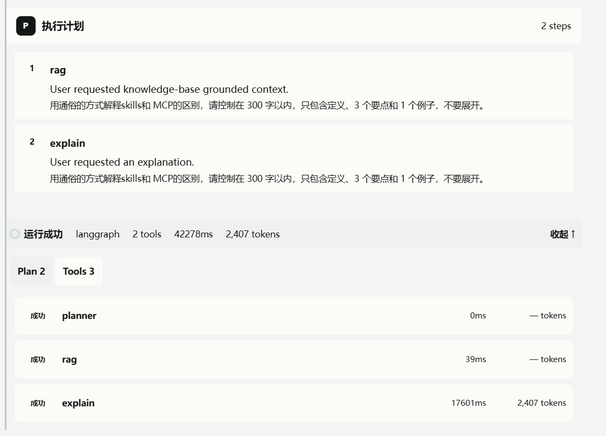

<div align="center">

# AI Study Assistant

**面向学习场景的 AI 应用**：Local RAG · Agent Tool Registry · 三层学习记忆 · 全链路可观测

[](https://github.com/ZQR1101/ai-agent-study-assistant/actions/workflows/tests.yml)

[](LICENSE)


[核心亮点](#highlights) · [快速开始](#quickstart) · [架构](#architecture) · [学习记忆](#memory) · [配置](#config) · [工具安全](#tool-safety) · [可观测性](#observability) · [评测](#benchmark) · [当前限制](#limitations) · [后续计划](#roadmap)

</div>

<a id="overview"></a>
## 📖 项目概览

AI Study Assistant 是一个面向学习场景的 AI 应用，而不是普通的 ChatGPT 套壳。它通过统一的 `POST /chat` API 连接 Local RAG、Agent Tool Registry 与可选 LangGraph Runtime，让回答可以检索本地知识、调用工具并保留 Sources。系统同时记录 `Run / Trace / Tool Calls / Latency / Token Usage / Estimated Cost / Judge`，便于调试和评估。项目包含可复现的 Offline RAG Benchmark，覆盖 Positive Cases、Negative-case Fallback、Source Pollution 与 PDF/OCR Chunk Quality。

支持三种安装方式：**PyPI**（完整本地 Web 应用 + CLI）、**源码安装**（开发）与 **Docker**（单一自包含容器），详见[快速开始](#quickstart)。

<a id="highlights"></a>
## ✨ 核心亮点

- **Unified `/chat` API**：统一承载 Chat、RAG、Agent 与 LangGraph Runtime。
- **Local RAG**：本地 FAISS/Document Index，支持 `Vector / BM25 / Hybrid RRF / CrossEncoder Reranker`，默认启用结构化 Chunk + 元数据增强。
- **Offline RAG Benchmark**：V1/V2/V3 分阶段构建 Corpus，V3 覆盖 55 Cases；Metrics 和原始结果可复现、可审计。
- **Retrieval Quality Controls**：修复 Negative-case Source Pollution，并过滤 PDF/OCR 产生的 Low-quality Chunks；Query Rewrite 已实测为当前负收益，默认关闭。
- **Tool Registry Safety**：Tools 按 `read / write / dangerous` 分级；Agent 对危险操作只创建持久化 Pending Action，必须由用户在对话中显式批准。
- **Run Observability**：统一查看 `Plan / Trace / Tool Calls / Sources / Latency / Token / Cost / Judge`。
- **Capability Modules**：将 Chat 与学习任务拆分为独立的 `capabilities/chat.py`、`capabilities/learn.py`，由 Agent、LangGraph 和普通对话复用，降低核心逻辑耦合。
- **Three-layer Learning Memory**：可选的 L1 事件、L2 事实、L3 学习者画像记忆；记忆上下文可注入 Chat、Learn 和 Agent Prompt，并支持将学习笔记保存到 Obsidian。
- **Versioned RAG Index**：索引按配置指纹和版本管理，记录 Embedding、Chunking、Reranker 等构建参数，避免模型或配置变化后误复用旧索引。


<a id="quickstart"></a>
## 🚀 快速开始

| 方式 | 适合场景 | 前置要求 |
|---|---|---|
| 方式一 — 从 PyPI 安装 | 直接使用完整 Web 应用 + CLI | Python 3.11+ |
| 方式二 — 从源码安装 | 参与开发、修改代码 | Python 3.11+ 与 Node.js 18+ |
| 方式三 — Docker | 自包含单容器部署 | Docker |

### 方式一 — 从 PyPI 安装 · 完整本地 Web 应用 + CLI，无需克隆仓库

```bash
pip install ai-study-assistant
```

安装后即可获得 `ai-study-assistant` 命令行工具，前端界面静态文件随 wheel 一起分发：

```bash
# 在当前目录生成 .env 与工作目录（docs/ rag_index/ data/ logs/）
ai-study-assistant init

# 编辑 .env 填入模型 API key，然后启动
ai-study-assistant serve
```

启动后访问 `http://127.0.0.1:8000` 即为完整 Web 界面，API 文档在 `http://127.0.0.1:8000/docs`。

| 命令 | 说明 |
|---|---|
| `ai-study-assistant serve [--host HOST] [--port PORT]` | 启动服务，默认 `127.0.0.1:8000` |
| `ai-study-assistant init [--force]` | 生成 `.env` 与工作目录，已存在则跳过 |
| `ai-study-assistant check` | 检查 Python 版本、依赖、配置与 RAG 索引 |
| `ai-study-assistant --version` | 查看版本 |

说明：

- 数据目录（`docs`、`rag_index`、`data`）默认使用当前工作目录；可用 `AI_STUDY_ASSISTANT_HOME` 指定固定根目录，或用 `DOCS_DIR` / `RAG_INDEX_DIR` 单独覆盖。
- Embedding 模型默认在首次向量检索时从 Hugging Face 下载；离线环境可将本地模型目录写入 `EMBEDDING_MODEL_PATH`。
- 可选扫描版 PDF OCR 支持：`pip install "ai-study-assistant[ocr]"`。

<details>
<summary><b>方式二 — 从源码安装 · 基于代码仓库进行开发</b></summary>

要求 Python 3.11+ 与 Node.js 18+。

```powershell
git clone https://github.com/ZQR1101/ai-agent-study-assistant.git
cd ai-agent-study-assistant

python -m venv .venv
.\.venv\Scripts\Activate.ps1
pip install -r requirements.txt
Copy-Item .env.example .env
```

在 `.env` 中配置模型 API key；本地离线测试不需要 key。

**启动后端**

```powershell
uvicorn backend.server:app --reload --host 127.0.0.1 --port 8000
```

**启动前端（开发模式，热更新）**

```powershell
npm install
npm run dev
```

前端默认地址：`http://127.0.0.1:5500`，开发模式自动连接 `http://127.0.0.1:8000` 的后端。

也可以构建前端产物后由后端直接托管，单进程验证生产形态：

```powershell
npm run build                              # 产物输出到 backend/static/
uvicorn backend.server:app --port 8000     # 访问 http://127.0.0.1:8000
```

**运行测试**

```powershell
.\.venv\Scripts\python.exe -m pytest
.\.venv\Scripts\python.exe scripts/check_setup.py
npm run build
```

</details>

<details>
<summary><b>方式三 — Docker · 单一自包含容器</b></summary>

镜像内已完成前端构建与后端依赖安装，一个容器同时提供 Web 界面和 API：

```bash
docker build -t ai-study-assistant .

docker run --rm -p 8000:8000 \
  -e DEEPSEEK_API_KEY=your_api_key_here \
  -v ./docs:/app/docs -v ./data:/app/data -v ./rag_index:/app/rag_index \
  ai-study-assistant
```

或直接使用 Compose（自动加载仓库 `.env`，数据卷持久化 + Hugging Face 缓存卷）：

```bash
docker compose up --build
```

- 容器内可变状态集中在 `/app`：知识库 `/app/docs`、运行数据 `/app/data`、RAG 索引 `/app/rag_index`、日志 `/app/logs`，均通过卷挂载持久化。
- Embedding 模型首次运行时自动下载，Compose 使用命名卷 `hf-cache` 缓存，重启容器不会重复下载。
- 健康检查基于 `/health` 端点。

</details>

<details>
<summary><b>维护者 — 构建并发布 PyPI 包</b></summary>

wheel 会打包前端构建产物（`backend/static`）与完整 `.env.example`（构建脚本暂存为 `backend/env.example`）：

```bash
python scripts/build_package.py    # npm build → 复制 env 示例 → python -m build
twine upload dist/*
```

发布前请确认 PyPI 包名可用（项目采用 MIT License，见 [LICENSE](LICENSE)）。

</details>

<a id="architecture"></a>
## 🏗️ 架构与请求流程

```text
React / Vite Frontend
  → POST /chat (FastAPI)
  → Capability Layer (Chat / Learn)
  → Local RAG / Agent Tool Registry / optional LangGraph Runtime
  → Memory Engine (optional L1 / L2 / L3)
  → RunRepository
  → Trace / Sources / Tool Calls / Judge
```

一次请求生成 `run_id`，RAG Sources、Plan、Tool Calls 和 Memory References 随 Run 聚合保存；前端使用同一份 Run 数据展示结果与诊断信息。能力层负责具体的对话和学习输出，Runtime 负责编排，Memory Engine 负责跨会话学习状态。

<a id="memory"></a>
## 🧠 学习记忆与笔记

记忆功能默认关闭，通过 `ENABLE_MEMORY=true` 开启，数据保存在 `data/memory/`：

- **L1 Event Memory**：追加记录学习事件，例如提问、完成课程、答题结果和 Agent Run。
- **L2 Fact Memory**：从事件中提炼可编辑、带置信度和来源引用的知识事实。
- **L3 Profile Memory**：聚合学习偏好、掌握程度和薄弱主题，作为后续 Prompt 的个性化上下文。

学习任务完成后可以自动记录和提炼记忆；`save_note` 工具还可以把 Markdown 笔记写入 `OBSIDIAN_VAULT_PATH/AI Study Assistant/`。Obsidian 目录只做原地写入或可选索引，不会默认复制进项目知识库。

<a id="config"></a>
## ⚙️ 配置与索引复现

首次运行前复制 `.env.example` 为 `.env`。RAG 默认使用本地 Embedding 模型，索引构建会保存版本和配置指纹；更换 Embedding 模型、Chunk 策略或 Reranker 参数后应重新构建索引。常用开关包括：

```env
ENABLE_MEMORY=false
ENABLE_OCR=false
ENABLE_RERANKER=false
RERANKER_TOP_N=15
QUERY_REWRITE_MODE=off
# OBSIDIAN_VAULT_PATH=C:\\Users\\you\\Documents\\Obsidian Vault
```

版本化索引和评测脚本会记录实际的候选数、Reranker Top-N、Query Rewrite 状态及延迟，便于在相同 Corpus 和参数下复现实验。


<a id="tool-safety"></a>
## 🛡️ 工具安全

Tool Registry 按 `read / write / dangerous` 分类。Dangerous Tool 必须经过独立的 requester / approver 凭据确认；一次性 confirmation token 与 tool name、arguments 和 requester 绑定，arguments 变化或 token 复用都会被拒绝。所有调用状态、耗时、参数摘要和审批事件写入 append-only JSONL audit log，并关联到对应 Run。

Agent 遇到删除、清空、重置或重建操作时不会直接执行，而是创建持久化的 Pending Action，并将 Run 标记为 `awaiting_action`。对话内确认卡片会展示影响范围、精确参数、可撤销性和过期时间；用户可批准或拒绝。批准后后端仍通过原有一次性 confirmation token 执行，拒绝、过期、失败和重复提交都会被记录或拦截。默认 Pending Action 保存在 `data/pending_actions`，有效期为 300 秒，可通过 `PENDING_ACTIONS_DIR` 和 `PENDING_ACTION_TTL_SECONDS` 调整。

默认情况下，`TOOL_APPROVAL_KEY` 与 `TOOL_APPROVER_KEY` 都需要 32 位以上且互不相同。本地开发如果嫌长 key 在 Swagger / Dev Tool Debugger 里复制麻烦，可以在 `.env` 打开：

```env
ENABLE_INSECURE_DEV_TOOL_KEYS=true
TOOL_APPROVAL_KEY=dev-req1
TOOL_APPROVER_KEY=dev-app1
```

这个开关只适合本机开发；共享、测试、生产环境请保持关闭。

<a id="observability"></a>
## 🔭 运行可观测性

`/chat` 返回 `run_id`，`/runs/{run_id}` 可查看 `status / plan / tools / audit / artifacts / output / metadata`。Run View 聚合 `Trace / RAG Sources / Step Latency / Token Usage / Estimated Cost / Judge`，便于定位 Planner Fallback、Retrieval Miss 与 Tool Failure。



<a id="benchmark"></a>
## 📊 RAG Benchmark / Evaluation

这是本地 Offline Retrieval Benchmark，不调用 LLM API。Top-1、Top-3 和 MRR 基于 V3 的 40 个 Positive Cases；Fallback Success 与 Source Pollution 基于 15 个 Out-of-knowledge Negative Cases。


### Corpus

| Version | Docs | Chunks | Cases | Corpus 说明 |
|---|---:|---:|---:|---|
| V1 | 51 | 341 | 20 | 本地项目文档 |
| V2 | 56 | 352 | 35 | V1 + 5 篇精选官方文档摘要 |
| V3 | 63 | 1438 | 55 | V2 + arXiv Paper PDFs + OCR Fixtures；结构化 Chunk + 元数据增强 |

### 主结果 · V3 Positive Cases

| Retrieval Mode | Top-1 | Top-3 | MRR | Avg Latency | P95 Latency |
|---|---:|---:|---:|---:|---:|
| `Vector` | 57.5% | 65.0% | 0.617 | 17.0 ms | 20.7 ms |
| `BM25` | 75.0% | 87.5% | 0.812 | 41.4 ms | 50.5 ms |
| `Hybrid` | 75.0% | 85.0% | 0.800 | 53.3 ms | 64.3 ms |
| `Hybrid + Reranker` | **90.0%** | **97.5%** | **0.933** | 1945.7 ms | 2722.0 ms |

### Source Pollution Fix

| Metric | Before | After |
|---|---:|---:|
| `Hybrid / Reranker Source Pollution` | 100.0% | **26.7%** |
| `Hybrid / Reranker Fallback Success` | 0.0% | **73.3%** |
| `Reranker Top-1 (Positive)` | 82.5% | 82.5% — Unchanged |
| `Reranker MRR (Positive)` | 0.863 | 0.863 — Unchanged |

修复在 Hybrid 上游增加 Unified Gate：当 Vector 无有效结果时，只有足够强的 BM25 Signal 才允许返回 Sources。Reranker 继承该 Gate，因此 Negative-case Fallback 得到改善，同时 Positive-case Top-1/MRR 保持不变。

### Structured Chunking / Metadata

当前默认启用结构化 Chunk 切分：按 Markdown 标题、章节标题和段落聚合，超长段落再滑窗切分。每个 Chunk 附带 `document / document_title / title / section / headings`，并让这些元数据进入 BM25、Embedding Text 和 Reranker 输入。

| Mode | Before Top-1 | After Top-1 | Before MRR | After MRR | Verdict |
|---|---:|---:|---:|---:|---|
| `Hybrid` | 60.0% | **75.0%** | 0.710 | **0.800** | Positive |
| `Hybrid + Reranker` | 82.5% | **90.0%** | 0.863 | **0.933** | Positive |

结论：结构化 Chunk + 元数据增强对最终 RAG 主路径是正收益，尤其提升 Hybrid 与 Hybrid+Reranker。收益来自更完整的语义边界和标题/章节元数据参与检索，而不是单纯增加 Chunk 数。

<details>
<summary><b>Chunk Quality Filter 数据</b></summary>

| Before | After | Dropped | Flagged `low_quality` | OCR Chunks Retained | Retrieval Metrics |
|---:|---:|---:|---:|---:|---|
| 1500 raw candidates | **1438 indexed** | 62 | 13 | **46** | `Hybrid / Reranker improved` |

Hard Filter Dropped 62 个噪声 Chunks；另外 13 个 Chunks 仅标记为 `low_quality`，未直接删除。当前重建索引保留 46 个 OCR Chunks，Chunk Quality Filter 正常工作。

</details>

<details>
<summary><b>Query Rewrite 消融数据（Conditional vs Always、历史 Rewrite-only）</b></summary>

Query Rewrite 能把用户问题交给 LLM 改写成更“检索友好”的形式，但此前全量替换原 Query 会损伤正样本召回。当前支持 `off / conditional / always` 三种模式，默认 `off`；`conditional` 仅用于生产灰度，只对“有历史对话、包含指代、问题较短且缺少强检索锚点”的上下文追问启用。含路径、版本号、错误码或多个英文实体的 Query 不会触发条件改写。

```env
# off（默认）/ conditional（生产灰度）/ always（benchmark）
QUERY_REWRITE_MODE=off
```

改写触发后不会再用改写 Query 覆盖原 Query，而是分别检索原 Query 和改写 Query，再用 RRF 合并候选。这样既保留原问题中的精确实体，也允许补全指代后的 Query 带回新增候选。Trace / Runtime Info 会记录 `query_rewrite_mode / attempted / used / reason / latency_ms / query_fusion_used`，可直接用于条件命中率、fallback 和延迟统计。

全量 rewrite benchmark 可在原批量入口追加 `--query-rewrite-mode always`；不传该参数时保持原始 `off` 基线。批量入口会让每个唯一 Query 只调用一次 rewrite API，四种检索模式复用同一改写结果和真实 latency。报告会附带实际 API 调用数、rewrite attempt / success / fallback count、平均 rewrite latency 和 query fusion 次数。

**Conditional vs Always（当前双查询 RRF）**

当前 40 条正样本 + 15 条负样本均为单轮问题，不含 `history_context`，因此 `conditional` 正确跳过全部 55 条 Query。该结果可以验证独立 Query 不会被误改写，但不能证明条件式改写对多轮指代追问的收益。

| Hybrid + Reranker | Conditional | Always | Always Delta |
|---|---:|---:|---:|
| Top-1 | **90.0%** | **90.0%** | 0.0 pts |
| Top-3 | **97.5%** | **97.5%** | 0.0 pts |
| MRR | **0.938** | 0.933 | -0.005 |
| Fallback Success | **80.0%** | **80.0%** | 0.0 pts |
| Source Pollution | **20.0%** | **20.0%** | 0.0 pts |
| Avg End-to-end Latency | **1628.6 ms** | 8867.6 ms | +7239.0 ms |
| P95 End-to-end Latency | **3121.3 ms** | 17616.4 ms | +14495.1 ms |

| Rewrite Metric | Conditional | Always |
|---|---:|---:|
| Attempts / Successes | 0 / 0 | 55 / 55 |
| Success Rate | N/A | 100.0% |
| Fallback Count | 0 | 0 |
| Actual API Calls | 0 | 55 |
| Avg Rewrite Latency | 0.0 ms | 5607.6 ms |
| P95 Rewrite Latency | 0.0 ms | 13622.2 ms |

结论：原 Query + 改写 Query 的 RRF 融合消除了旧版“仅使用改写 Query”造成的大幅召回回归，Always 的最终 Top-1 / Top-3 保持在 90.0% / 97.5%；但它没有改善最终主路径的命中率、fallback 或 source pollution，MRR 还下降 0.005，并将平均端到端延迟从 1.63 秒提高到 8.87 秒。因此生产默认继续使用 `off`；补充带历史上下文的多轮 benchmark 后再判断 `conditional` 是否值得开启，`always` 仅保留用于消融实验。

**历史 Rewrite-only Ablation**

旧实验直接用改写 Query 替换原 Query，未执行双查询融合：

| Hybrid + Reranker | Original Query | Rewrite-only | Delta |
|---|---:|---:|---:|
| Top-1 | **90.0%** | 82.5% | -7.5 pts |
| Top-3 | **97.5%** | 90.0% | -7.5 pts |
| MRR | **0.933** | 0.875 | -0.058 |
| Fallback Success | 73.3% | **80.0%** | +6.7 pts |
| Source Pollution | 26.7% | **20.0%** | -6.7 pts |

旧实验的 Rewrite 调用成功率为 100.0%，Fallback Count 为 0，平均 Rewrite Latency 为 3850.9 ms。该结果仅作为历史对照，不代表当前双查询 RRF 实现。

</details>

<details>
<summary><b>Reranker Candidate Top-N 数据</b></summary>

`RERANKER_TOP_N` 表示送入 CrossEncoder 打分的候选数，最终返回数量仍由请求的 `top_k` 决定。当前默认值从 20 调整为 15：在现有 40 正样本 + 15 负样本上保持 reranker 的 Top-1、Top-3、MRR、fallback 和 source pollution 结果，同时降低平均和 P95 延迟。Runtime Info 会记录 `reranker_top_n` 与 `reranker_candidate_count`，便于确认实际送入 reranker 的候选规模。

**测试数据**

| 项目 | 测试值 |
|---|---|
| 测试样本 | 55 条：40 条正样本 + 15 条负样本 |
| 样本来源 | `eval_cases/rag_v1_cases.json`、`rag_v2_cases.json`、`rag_v3_cases.json` |
| 知识库规模 | 359 documents、2,579 indexed chunks |
| 检索模式 | Hybrid + CrossEncoder Reranker |
| 最终返回数量 | `top_k=5` |
| Reranker 模型 | `bge-reranker-base` |
| 对照参数 | `RERANKER_TOP_N=10 / 15 / 20` |
| 评价指标 | Top-1、Top-3、MRR、Fallback Success、Source Pollution、平均延迟、P95 延迟 |
| 索引处理 | 直接复用现有 `rag_index/index.faiss` 和 `chunks.json`，未重新解析 documents、OCR 或构建 Embedding |

三组 Top-N 使用同一份索引、同一套样本和同一个 reranker 模型，保证对照只改变送入 CrossEncoder 的候选数量。

| Reranker Top-N | Top-1 | Top-3 | MRR | Fallback Success | Source Pollution | Avg Latency | P95 Latency |
|---:|---:|---:|---:|---:|---:|---:|---:|
| 10 | 82.5% | 90.0% | 0.863 | 80.0% | 20.0% | 1063.1 ms | 1516.9 ms |
| **15** | **90.0%** | **97.5%** | **0.938** | **80.0%** | **20.0%** | **1274.8 ms** | **2025.6 ms** |
| 20 | 90.0% | 97.5% | 0.938 | 80.0% | 20.0% | 1711.8 ms | 2995.2 ms |

结论：`top_n=10` 延迟更低但召回明显下降；`top_n=15` 与 20 的结果完全一致，平均延迟降低约 25.5%，P95 降低约 32.3%，因此当前默认使用 15。详细记录见 [Reranker Top-N report](reports/RAG_RERANKER_TOPN_REPORT.md)。

</details>

<details>
<summary><b>BM25 Term Coverage / Entity Gate 数据</b></summary>

BM25 路径新增 Term Coverage 与 Entity Matching Gate，用于过滤 BM25 的假阳性候选。对每条候选分别计算：

- `bm25_term_coverage`：命中 BM25 词项 / Query 词项
- `bm25_entity_match_count`：命中实体词项数量
- `bm25_entity_term_coverage`：命中实体词项 / Query 实体词项

过滤规则：若 Query 含实体词（缩写、英文术语、API 路径、文件名、数字等），至少一个实体必须命中且实体覆盖率达标；若无实体词，候选必须通过最低词项覆盖率门槛。目标是对 “Kubernetes HPA” 匹配到通用中文项目文档这类假阳性做精准拦截。

Benchmark 在 359 Docs / 2579 Chunks 的当前工作区索引上运行，对比关闭/开启 Gate 两组实验（40 Positive + 15 Negative Cases，top_k=5）。

**With BM25 Gate（当前默认）**

| Mode | Top-1 | Top-3 | MRR | Fallback Success | Source Pollution |
|---|---:|---:|---:|---:|---:|
| `BM25` | 75.0% | 87.5% | 0.812 | 40.0% | 60.0% |
| `Hybrid` | 72.5% | 85.0% | 0.799 | 80.0% | 20.0% |
| `Hybrid+Reranker` | **90.0%** | **97.5%** | **0.938** | 80.0% | 20.0% |

**Delta（Gate 开启 vs 关闭）**

| Mode | Top-1 | Top-3 | MRR | Fallback | Pollution |
|---|---:|---:|---:|---:|---:|
| `BM25` | +2.5 pts | +7.5 pts | +0.050 | +40.0 pts | **-40.0 pts** |
| `Hybrid` | -2.5 pts | 0.0 pts | -0.001 | +13.3 pts | -13.3 pts |
| `Hybrid+Reranker` | 0.0 pts | 0.0 pts | +0.005 | +13.3 pts | -13.3 pts |

**Source Pollution 修复详情**

| Mode | 已修复 | 仍残留 |
|---|---|---|
| `BM25` | 6 例（blockchain, ios, kubernetes, celery, cv, graph_neural_network） | 9 例 |
| `Hybrid` | 2 例（kubernetes, prometheus） | 3 例（django, graph_neural_network, quantum） |
| `Hybrid+Reranker` | 2 例（kubernetes, prometheus） | 3 例（django, graph_neural_network, quantum） |

**结论**：BM25 Gate 整体为正收益。BM25-only Source Pollution 从 100.0% 降至 60.0%，同时 Top-1 / Top-3 / MRR 均提升。Hybrid+Reranker 保持 Top-1 和 Top-3 不变，MRR 微增，Source Pollution 从 33.3% 降至 20.0%。残留污染案例指向语义相邻但超出知识范围的实体，下一步应加强多实体 Query 的实体覆盖率要求，并维护高价值领域别名 Allowlist 以避免过度过滤正样本。

</details>

### Reports / Reproduction

- [Full benchmark report](reports/RAG_V1_V2_V3_BENCHMARK.md)
- [BM25 Term/Entity Gate report](reports/RAG_BM25_ENTITY_GATE_REPORT.md)
- [Query Rewrite Conditional vs Always report](reports/RAG_QUERY_REWRITE_CONDITIONAL_ALWAYS_REPORT.md)
- [Reranker Top-N report](reports/RAG_RERANKER_TOPN_REPORT.md)
- [Machine-readable metrics](reports/RAG_V1_V2_V3_METRICS.json)
- [V3 evaluation cases](eval_cases/rag_v3_cases.json)
- [Benchmark runner](scripts/benchmark_rag_batch.py)
- Latest local run：`outputs/rag_query_rewrite_opt/v3_query_rewrite_opt_full_retrieval.json`
- Query rewrite ablation：`outputs/rag_query_rewrite_opt/v3_query_rewrite_eval.json`

<a id="tests"></a>
## ✅ 测试结果

2026-07-06 本地验证：

| Check | Result |
|---|---|
| Python Test Suite | **235 passed, 60 subtests passed** |
| `scripts/check_setup.py` | **OK** |
| Frontend Build (`npm run build`) | **Successful** |

<a id="limitations"></a>
## ⚠️ 当前限制

- Benchmark 是本地 Offline Evaluation，不代表生产环境指标或通用准确率。
- V3 仅包含 40 个 Positive Cases 和 15 个 Negative Cases，样本规模仍有限。
- Reranker 效果最好，但本地 Avg Latency 约 1.9 秒。
- OCR-specific Eval Cases 有限，不能据此宣称通用 OCR 准确率提升。
- BM25-only Source Pollution 经 Term/Entity Gate 已从 100.0% 降至 60.0%，但仍残留在语义相邻但超出知识范围的实体上，如 quantum / django / graph_neural_network。
- Query Rewrite 当前全量开启会降低正样本召回，因此默认关闭。
- File-based RunRepository 与可选 SQLite 配置更适合单机原型，尚未面向 Distributed Execution 设计。

<a id="roadmap"></a>
## 🗺️ 后续计划

- 对 `low_quality` Chunks 做 Down-ranking，而不是只做 Hard Filter。
- 增加 Context Selection Gate。
- 增加 History Relevance Filter。
- 将 Query Rewrite 改成条件式启用：仅处理口语化、指代省略或上下文依赖 Query。
- BM25 Term Coverage / Entity Gate 已实现，后续加强多实体 Query 覆盖率与领域别名 Allowlist。
- 扩充 Positive/Negative Cases 与 PDF/OCR Eval Cases。

<a id="acknowledgements"></a>
## 🙏 致谢

本项目构建在以下开源项目之上：

- [FastAPI](https://github.com/fastapi/fastapi) — API 服务与文档
- [LangChain](https://github.com/langchain-ai/langchain) / [LangGraph](https://github.com/langchain-ai/langgraph) — LLM 编排与可选 Runtime
- [FAISS](https://github.com/facebookresearch/faiss) — 本地向量检索
- [sentence-transformers](https://github.com/UKPLab/sentence-transformers) 与 [BGE](https://huggingface.co/BAAI)（BAAI）— Embedding 与 CrossEncoder Reranker
- [React](https://github.com/facebook/react) + [Vite](https://github.com/vitejs/vite) — 前端界面

如果这个项目对你有帮助，欢迎点一个 Star ⭐

[](https://star-history.com/#ZQR1101/ai-agent-study-assistant&Date)
